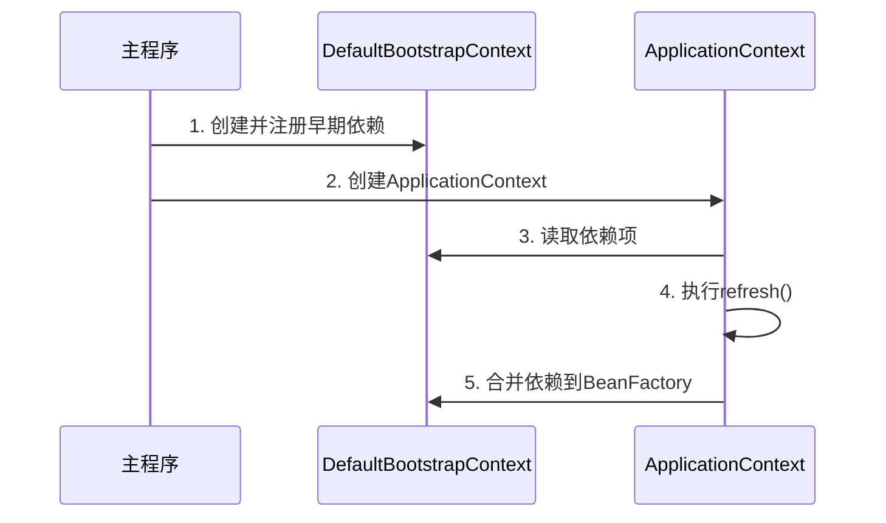

`DefaultBootstrapContext` 是 Spring Framework 5.2+ 引入的**引导上下文**，主要用于在 Spring 容器（`ApplicationContext`）**完全初始化之前**，为某些组件提供**早期的依赖访问和环境支持**。以下是其核心作用、使用场景及工作原理的详细解析：

---

### **1. 核心作用**

- **早期依赖注册**：
  在 `ApplicationContext` 初始化前，允许注册少量关键依赖（如配置类、环境变量），供其他组件在启动阶段使用。
- **生命周期分离**：
  解耦部分组件的初始化逻辑，避免循环依赖问题。
- **性能优化**：
  减少容器启动时的阻塞操作，提升启动速度。

---

### **2. 使用场景**

#### **(1) Spring Cloud 上下文引导**

在 Spring Cloud 应用中，`BootstrapContext` 用于在**主应用上下文创建前**加载远程配置（如从 Config Server 获取配置）。

```java
// 示例：Spring Cloud 的 BootstrapApplicationListener
public void onApplicationEvent(ApplicationEnvironmentPreparedEvent event) {
    BootstrapContext bootstrapContext = new DefaultBootstrapContext();
    bootstrapContext.register(ConfigClientProperties.class, configClientProperties);
    // 其他早期初始化逻辑
}
```

#### **(2) 自定义 Starter 开发**

在 Spring Boot Starter 中，若某些组件需在主容器就绪前使用（如日志系统、监控代理），可通过 `BootstrapContext` 提前注册。

```java
@Configuration
public class MyStarterAutoConfiguration {
    @Bean
    public MyEarlyService myEarlyService(BootstrapContext bootstrapContext) {
        // 从 BootstrapContext 获取早期依赖
        Config config = bootstrapContext.get(Config.class);
        return new MyEarlyService(config);
    }
}
```

#### **(3) 测试框架支持**

在集成测试中，提前注入测试所需的模拟依赖。

```java
@Test
void testWithBootstrapContext() {
    DefaultBootstrapContext bootstrapContext = new DefaultBootstrapContext();
    bootstrapContext.register(MockDataSource.class, new MockDataSource());
    // 启动测试上下文
}
```

---

### **3. 工作原理**

#### **(1) 与 `ApplicationContext` 的关系**

- **阶段差异**：
  `BootstrapContext` 在 `ApplicationContext` **构造后、刷新前**（即 `refresh()` 方法调用前）生效。
- **数据传递**：
  `BootstrapContext` 中的注册项最终会合并到主容器的 `BeanFactory` 中。

#### **(2) 关键方法**


| 方法名                                           | 作用                                                          |
| ------------------------------------------------ | ------------------------------------------------------------- |
| `register(Class<T> type, T instance)`            | 注册一个实例到上下文，后续可通过`get(Class<T>)` 获取。        |
| `get(Class<T> type)`                             | 获取已注册的实例，若不存在返回`null`。                        |
| `getOrElse(Class<T> type, Supplier<T> supplier)` | 获取实例，不存在时通过`Supplier` 创建并注册。                 |
| `close()`                                        | 关闭上下文，释放资源（通常由`ApplicationContext` 自动调用）。 |

#### **(3) 生命周期时序**



---

### **4. 与相似组件的对比**


| **组件**                   | **作用阶段**           | **主要用途**                     | **是否支持依赖注入**  |
| -------------------------- | ---------------------- | -------------------------------- | --------------------- |
| `DefaultBootstrapContext`  | 容器初始化前           | 提供早期依赖访问                 | 否（需手动注册/获取） |
| `ApplicationContext`       | 容器完全初始化后       | 完整的依赖管理和Bean生命周期控制 | 是                    |
| `BeanFactoryPostProcessor` | `BeanFactory` 准备阶段 | 修改Bean定义或注册新定义         | 是（但限制较多）      |

---

### **5. 实际代码示例**

#### **(1) 注册与获取早期依赖**

```java
public class MyBootstrapInitializer {
    public static void main(String[] args) {
        DefaultBootstrapContext bootstrapContext = new DefaultBootstrapContext();
        // 注册关键配置
        bootstrapContext.register(EnvConfig.class, new EnvConfig("prod"));

        // 模拟某个组件在早期阶段使用配置
        EnvConfig config = bootstrapContext.get(EnvConfig.class);
        System.out.println("Environment: " + config.getEnv());

        // 创建主应用上下文（实际由SpringBoot自动处理）
        AnnotationConfigApplicationContext context = new AnnotationConfigApplicationContext();
        context.refresh();
    }
}
```

#### **(2) 在 Spring Boot 中的集成**

通过 `BootstrapRegistry`（Spring Boot 2.4+ 对 `BootstrapContext` 的增强）：

```java
@SpringBootApplication
public class MyApp {
    public static void main(String[] args) {
        SpringApplication app = new SpringApplication(MyApp.class);
        app.addBootstrapRegistryInitializer(registry -> {
            registry.register(MyEarlyService.class, new MyEarlyService());
        });
        app.run(args);
    }
}
```

---

### **6. 注意事项**

1. **非全局通用**：
   大多数应用无需直接使用 `BootstrapContext`，除非有明确的早期初始化需求。
2. **生命周期短暂**：
   `BootstrapContext` 在 `ApplicationContext` 刷新完成后会被关闭，其内容会转移到主容器。
3. **线程安全**：
   需确保在单线程环境下注册/访问（通常在启动阶段完成）。

---

### **总结**

`DefaultBootstrapContext` 是 Spring 为**复杂启动场景**设计的临时依赖管理工具，核心价值在于：

- **解耦启动依赖**：允许部分组件提前初始化。
- **支持分层配置**：如 Spring Cloud 的多级上下文。
- **提升灵活性**：为框架开发者提供更多控制权。

对于普通应用，通常通过 `ApplicationContext` 即可满足需求；而在框架开发或云原生场景中，`BootstrapContext` 能显著简化早期资源管理。
